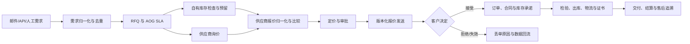
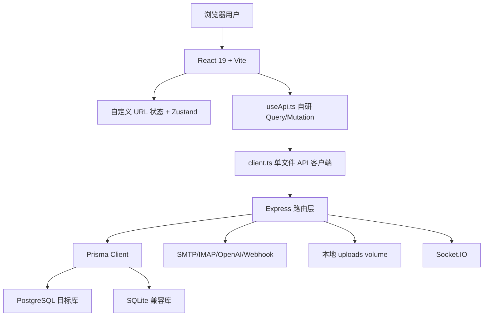
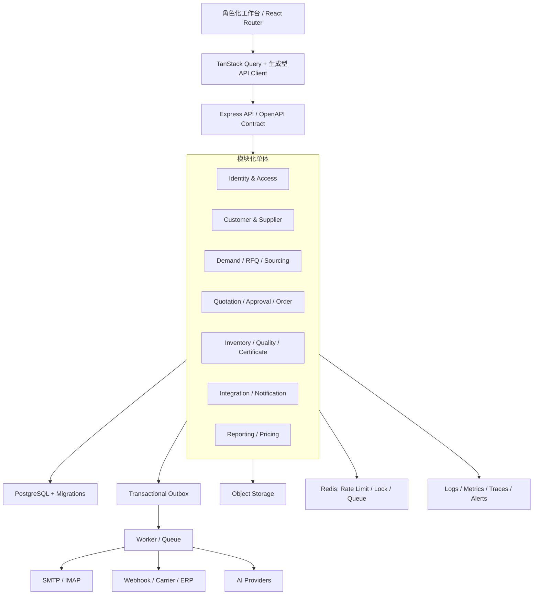

# AeroLink 产品代码与架构审核及优化方案

> 文档版本：v1.0  
> 审核日期：2026-07-14  
> 审核对象：AeroLink 航材交易平台  
> 审核范围：产品文档、React 前端、Express 后端、Prisma 数据模型、部署配置、CI/CD、测试与依赖安全  
> 结论性质：基于当前工作区源码与本地验证结果，不等同于生产环境渗透测试、合规认证或真实业务验收

---

## 1. 执行摘要

### 1.1 总体结论

AeroLink 已经具备较强的功能广度，核心的“需求归集 → RFQ → 报价 → 审批 → 发送 → 客户确认 → 订单/合同”链路也有真实后端、数据库和自动化测试支撑，不是单纯的 UI 原型。

但当前版本仍不满足生产就绪要求。主要原因不是缺少更多功能，而是已有功能在安全、状态一致性、数据口径、上线流程和产品真实性方面存在系统性缺口：

1. 存在可利用的存储型 XSS 链路，且访问令牌保存在 `localStorage`，风险可组合放大。
2. 加密密钥文件已经进入 Git 跟踪历史；生产启动又会自动写入已知默认密码的演示账户。
3. 两套生产 Compose 均未传入后端强制要求的 `JWT_REFRESH_SECRET`，干净环境会直接启动失败。
4. CI/E2E 流程在干净 Runner 上无法形成可信门禁，Deploy 工作流也没有真正部署动作。
5. RFQ 状态操作有一部分只更新前端 Zustand 内存，刷新即丢；前后端状态枚举还不一致。
6. 主要列表接口默认只返回 20 条，前端请求层丢弃分页元数据后又做客户端分页，因此第 21 条之后的数据对用户不可见。
7. 库存同时维护 `Inventory` 与 `InventoryItem/InventoryDetail` 两套模型，页面、报表、FMV、VMI 和出库事务使用的口径不一致。
8. 定价 BI、报表、技术兼容性、AI 寻源和“区块链存证”仍包含随机值、模糊匹配、Mock 兜底或本地哈希链，但部分入口未明确标为实验功能。

因此，建议立即停止继续横向增加新模块，先用 6–12 周完成一次“核心交易闭环收敛”。

### 1.2 发布建议

| 场景 | 当前建议 | 前置条件 |
|---|---|---|
| 对公网正式生产 | **No-Go** | 至少完成全部 P0，并通过隔离环境 E2E、备份恢复和安全复测 |
| 内部真实业务试点 | **有条件 No-Go** | 完成 P0 + RFQ 状态持久化 + 分页修复 + 单一库存口径 |
| 受控演示 | **可继续** | 使用隔离演示环境；清晰标注 Demo/Beta；禁止接入真实敏感数据 |
| 新功能扩张 | **暂停** | 核心链路达到本文定义的 M3 后再恢复 |

### 1.3 当前最值得保留的基础

- 前后端均启用了 TypeScript 严格模式，构建可通过。
- Express 已具备 JWT、Helmet、限流、审计日志、Webhook 重试、Socket.IO 和结构化日志等基础设施。
- Prisma 模型已覆盖交易、库存、证书、工作流、Webhook、API Key、拍卖、寄售等主要领域。
- 报价发送、撤回、客户确认、自动建单、合同生成已有事务处理和较集中的回归测试。
- 页面已按需加载并完成分包，当前前端生产构建最大包为图表依赖约 421 kB（gzip 约 113 kB）。
- PostgreSQL 与 SQLite 两套 Prisma Schema 均能通过静态校验，为正式收敛 PostgreSQL 留有基础。

### 1.4 本轮已启动的优化（工作区状态，尚未发布）

本次用户确认“启动优化”后，已先落地一批低风险、可验证的 Phase 0 改动：

- 证书模板服务端增加 HTML 白名单净化，模板写入/复制/读取统一处理；创建、编辑、删除和复制仅允许管理员/总经理。
- 证书模板前端预览改为无脚本 `sandbox` iframe，移除 `dangerouslySetInnerHTML`。
- 两套生产 Compose 补齐必填的 `JWT_REFRESH_SECRET`，并要求显式提供 `PUBLIC_ORIGIN`。
- 生产入口默认关闭演示 seed；只有显式设置 `SEED_DEMO_DATA=true` 才会播种。
- Nginx 增加 CSP、HSTS、反点击劫持、MIME 嗅探和 Referrer/Permissions 策略头。
- CI E2E 改用隔离 PostgreSQL，显式执行 schema 初始化和 seed，移除重复启动后端及吞掉健康检查失败的逻辑；Deploy 工作流移除无效的跨工作流 `needs` 并生成后端产物。
- `.gitignore` 增加 `secrets/*` 保护规则；已被 Git 跟踪的历史密钥仍需单独轮换和按影响范围清理。
- RFQ 状态操作改为调用后端状态接口；前后端状态别名统一，后端拒绝非法状态迁移并返回统一 UI 状态。
- 订单状态接口收敛为固定状态集合和合法迁移，重复状态不再重复发送 Webhook；`Order.quotationId` 增加唯一约束和状态/创建时间索引，正式切库前必须先做重复报价订单数据清理。
- 生产启动入口增加订单唯一性 preflight：空库自动跳过；发现重复 `quotationId` 时在 `prisma db push` 前阻断启动并输出待清理记录，紧急情况下可显式使用 `SKIP_SCHEMA_PREFLIGHT=true` 绕过。
- 报价提交与审批接口接入独立状态机，拒绝从已接受/已发送等状态越权跳转；同态重试直接返回当前状态，不重复写审批记录或 Webhook。
- API Key 管理路由增加管理员/总经理权限门槛，普通业务账号不能再读取、创建、撤销或修改全局 API Key。
- 访问令牌过期时使用单飞刷新请求更新 access token，同一时刻的并发请求共享刷新结果；refresh token 改由 HttpOnly Cookie 传输，登出会清除 Cookie，刷新失败才退出登录。
- JWT 增加用户会话版本号；密码修改、密码重置和账号启停会递增版本，旧 access/refresh token 会被服务端拒绝。
- API 客户端增加保留分页 envelope 的通道，审计日志、工作流实例、Webhook、RFQ、报价、订单、客户、供应商和库存列表开始保留 `pagination`；这些主列表默认页大小提高到 100，后续仍需把页面筛选完全迁移到服务端。
- 导航回归 E2E 按实际可折叠侧栏分组展开后再定位子项，避免把 UI 的初始折叠状态误判为页面不可用。

以上改动已通过后端 88 项测试、前端 17 项测试及构建/lint、两套 Prisma Schema 校验和两套 Compose 配置解析；真实隔离环境 E2E 已完成数据库准备和构建，导航回归已通过，报价/合同回归仍在执行。因此它们还没有替代正式的生产迁移基线、TLS 终止和依赖升级，也不会改变本文的当前 No-Go 结论。

---

## 2. 审核方法与验证结果

### 2.1 审核依据

本次主要检查了以下内容：

- 产品预期：`README.md`、`AeroLink_后续开发方案_v1.0.md`、`航材交易平台_表单完善建议.md`、`docs/功能补全计划.md`。
- 前端：`src/App.tsx`、`src/sections/`、`src/api/client.ts`、`src/hooks/useApi.ts`、Zustand stores、路由与导航。
- 后端：46 个业务路由文件、中间件、核心服务、邮件/Webhook/AI/定价/库存实现。
- 数据：`server/prisma/schema.prisma`、`schema.sqlite.prisma`、迁移目录和生产启动脚本。
- 工程：GitHub Actions、Docker Compose、Nginx、测试、构建和依赖安全。

### 2.2 本地验证结果

| 验证项 | 结果 | 说明 |
|---|---:|---|
| 前端 `npm run build` | 通过 | Vite 共转换 2518 个模块 |
| 前端 `npm run lint` | 通过 | 当前没有 ESLint 错误输出 |
| 前端 Vitest | 17/17 通过 | 5 个测试文件 |
| 后端 `npm run build` | 通过 | TypeScript 编译通过 |
| 后端 Vitest | 88/88 通过 | 15 个测试文件（含模板净化、RFQ、报价/订单状态、API Key 权限、刷新 Cookie 与会话版本回归） |
| Prisma PostgreSQL Schema | 通过 | `prisma validate` 通过 |
| Prisma SQLite Schema | 通过 | `prisma validate` 通过 |
| 订单唯一性 preflight | 通过 | SQLite 本地库检查 2 个报价引用；无重复 `quotationId` |
| Playwright 用例发现 | 20 条 | 分布在 6 个 spec 文件 |
| 前端生产依赖审计 | 0 个漏洞 | `npm audit --omit=dev`，官方 npm registry |
| 后端生产依赖审计 | 16 个漏洞 | 9 High、7 Moderate；含 `multer`、`nodemailer`、`mailparser`、`imap-simple` 等 |
| 缺少刷新密钥启动实验 | 按预期失败 | 报错：`JWT_SECRET and JWT_REFRESH_SECRET must be set` |
| Git 敏感文件检查 | 发现问题 | `secrets/encryption_key.txt` 已被 Git 跟踪且出现在提交历史中 |

### 2.3 未执行项与边界

- 未连接或检查线上服务器、线上数据库、日志、备份、域名证书和云安全组。
- 未验证真实 SMTP/IMAP、OpenAI、物流承运商、ERP 或外部数据源。
- 未执行会写入当前业务数据库的全量 E2E。现有 Playwright 用例包含创建真实 RFQ/报价/订单的操作，而仓库尚未提供稳定的隔离数据库编排；本次仅完成用例发现和静态审查。
- 订单唯一性 preflight 本次仅使用本地 SQLite 数据库验证通过；未使用真实生产 PostgreSQL 凭据执行检查，正式切库前仍需在备份/演练环境运行。
- 未进行专业渗透测试、软件成分分析平台复核或航空适航合规认证。

---

## 3. 基于产品目标的预期设计

### 3.1 产品定位建议

AeroLink 的近期定位应收敛为：

> 面向中小型航材贸易商与 MRO 团队的交易执行和供应链协同系统，以 RFQ 响应速度、报价赢单率、库存可用性和航材追溯完整性为核心价值。

近期不宜同时把产品定位为交易平台、MRO 全栈系统、AI Agent 平台、FMV 数据平台、拍卖平台、区块链平台和开放生态。当前团队更适合先建立“可信交易记录系统”，再从真实交易数据上生长智能能力。

### 3.2 关键角色与首要任务

| 角色 | 首要任务 | 首页应优先展示 |
|---|---|---|
| 销售 | 快速识别 RFQ、组织报价、跟进客户 | 待处理 RFQ、待报价、待客户确认、超时 SLA |
| 采购/寻源 | 找到可供货库存和合格供应商 | 待寻源件号、询价反馈、供应商风险、交期冲突 |
| 仓库/质量 | 确认库存可用、出库、证书与追溯 | 待检验、待出库、证书缺失、时寿/保质期预警 |
| 财务/经理 | 审批毛利、信用、金额和条款 | 待审批、异常毛利、信用超限、合同风险 |
| 管理层 | 关注转化率、毛利、库存周转和 SLA | 真实经营指标与口径说明 |
| 外部供应商 | 接收询价、提交报价、上传资质 | 专属询价、报价状态、资质到期提醒 |

### 3.3 应有的核心交易闭环



所有箭头都必须满足四个条件：服务端持久化、合法状态迁移、幂等、可审计。当前产品最大的问题正是部分箭头只完成了 UI 展示或局部数据写入。

### 3.4 近期产品范围建议

| 分层 | 建议范围 |
|---|---|
| 正式能力 | 需求归集、RFQ、寻源、供应商报价、销售报价、审批、订单、库存、合同、证书、基础报表、审计 |
| 试点能力 | 供应商门户、物流追踪、工作流、VMI、开放 API/Webhook、规则型价格建议 |
| 实验能力 | AI 自动执行、Pricing BI/FMV、拍卖、寄售、技术兼容性、区块链哈希链 |
| 暂缓 | 微服务拆分、Elasticsearch、大数据平台、真正链上存证、复杂 ML、多租户 SaaS |

实验能力必须由服务端 Feature Flag 控制，并在 UI、API 和导出文件中同时标明数据来源、算法版本、样本量和“不可作为最终适航/财务依据”的边界。

---

## 4. 当前架构盘点

### 4.1 当前结构



### 4.2 规模信号

| 项目 | 当前规模 |
|---|---:|
| 前端业务目录 | 28 |
| 后端路由文件 | 46 |
| 后端路由代码 | 约 11,697 行 |
| Prisma 模型 | 60 |
| Prisma Enum | 0 |
| `schema.prisma` | 1,661 行 |
| `src/api/client.ts` | 2,938 行 |
| `src/hooks/useApi.ts` | 987 行 |
| 最大页面文件 | Inventory 2,179 行 |
| 后端测试文件 | 14 |
| 前端测试文件 | 5 |

代码规模已经越过“继续在单文件堆功能”的安全区，但尚不需要微服务。最合适的下一步是模块化单体：按业务边界拆分服务与前端 feature，而不是拆成分布式系统。

---

## 5. 功能成熟度评估

成熟度定义：M0 为静态展示，M1 为可演示，M2 为受控可用，M3 为生产可运营，M4 为规模化。

| 领域 | 当前成熟度 | 主要依据 | 目标 |
|---|:---:|---|:---:|
| 登录与用户 | M1 | 有 JWT/激活/重置，但刷新链路未使用、生产密钥配置缺失 | M3 |
| RFQ/需求管理 | M1 | CRUD 可用，但状态操作局部仅前端内存，状态集合不一致 | M3 |
| 寻源与供应商报价 | M1–M2 | 有询价/报价模型；供应商能力仍混入 Mock 门户数据 | M3 |
| 销售报价/审批 | M2 | 真实发送、撤回、审批和测试较完整；状态机与权限仍需收敛 | M3 |
| 订单/合同 | M2 | 自动建单和合同可用；并发幂等和文档失败补偿不足 | M3 |
| 库存/出库 | M1 | 有事务出库，但存在两套库存真相源 | M3 |
| 客户/供应商主数据 | M2 | 基础 CRUD 较完整；分页与权限策略不统一 | M3 |
| 证书/质量 | M1 | 功能面广，但模板存在 XSS，适航证据链与权限不足 | M3 |
| 供应商门户 | M0–M1 | 当前更像内部管理页；邀请令牌没有供应商注册消费链路 | M2 |
| 物流追踪 | M1 | 主要为数据库读取与规则推导，没有承运商事件接入闭环 | M2 |
| VMI/换件 | M1 | 部分使用真实数据，但仍标 Demo，业务写操作不完整 | M2 |
| Pricing BI/FMV | M0–M1 | 存在随机置信度、竞品价与丢单原因 | M2 |
| AI Agent | M1 | 有运行时审计，但演示模式和 Mock 兜底会影响真实性 | M2 |
| API/Webhook | M1–M2 | Webhook 能力较多；API Key 管理权限与限流仍不适合生产 | M3 |
| 拍卖/寄售 | M1 | 模型与页面较完整，关键业务测试和真实试点不足 | M2 |
| “区块链”存证 | M0–M1 | 实际为同库内 SHA-256 哈希链，不具备独立信任锚 | M1 或更名 |
| 部署与运维 | M0–M1 | 构建可用，但生产启动、迁移、TLS、CI/CD 有阻断项 | M3 |

---

## 6. 关键问题与优化建议

### 6.1 P0：发布阻断项

| ID | 问题与证据 | 业务影响 | 建议动作 | 验收标准 |
|---|---|---|---|---|
| P0-01 | 证书模板预览直接使用 `dangerouslySetInnerHTML`，后端原样保存 HTML；模板路由仅要求登录。见 `src/sections/CertificateTemplates/index.tsx:285,290,295`、`server/src/index.ts:154`、`server/src/routes/certificateTemplates.ts:92-129` | 任意已登录用户可能植入存储型 XSS；令牌又位于 `localStorage`，可导致账号接管 | 模板写接口限制为质量管理员/管理员；服务端白名单净化 HTML；预览放入无脚本 sandbox iframe；增加 CSP；补 XSS 回归测试 | 常见 `<script>`、事件属性、危险 URL 均被清除；非授权角色返回 403；浏览器端令牌不可被脚本读取 |
| P0-02 | `secrets/encryption_key.txt` 已被 Git 跟踪并存在历史提交；`.gitignore` 未覆盖 `secrets/` | 邮箱授权码等密文可能失去保密性 | 立即轮换加密密钥和受该密钥保护的凭据；停止跟踪；按仓库共享范围决定是否清理历史；接入 secret scanning | Git 全历史扫描无有效密钥；旧密钥失效；所有密文完成可验证重加密 |
| P0-03 | 生产 Compose 只传 `JWT_SECRET`，而后端启动强制同时要求 `JWT_REFRESH_SECRET`。见 `docker-compose.prod.yml:43-49`、`docker-compose.prod.sqlite.yml:25-31`、`server/src/middleware/auth.ts:6-10` | 干净生产环境后端启动即退出 | 补齐独立刷新密钥；在 Compose 层用必填校验；增加容器启动冒烟测试 | 干净主机执行 Compose 后健康检查通过，缺任一密钥时在配置阶段失败 |
| P0-04 | 生产入口执行 `prisma db push`，空库自动执行包含 `password123` 的完整演示 seed。见 `deploy/server-entrypoint.sh:8-25`、`server/src/seed.ts:224-249`、`README.md:127-135` | 结构变更不可审计，且新生产环境出现已知凭据和演示业务数据 | 改为 `prisma migrate deploy`；生产默认禁止 seed；使用一次性管理员激活流程；演示数据只允许专用 profile | 生产空库只创建结构和一次性管理员；无默认密码、无演示客户/订单；迁移可回滚演练 |
| P0-05 | CI E2E 使用 `npm start` 却没有在该 job 构建 `server/dist`，缺刷新密钥，健康路径写成 `/health` 并用 `|| true` 掩盖失败；同时 Playwright 配置还会再启动一套服务。见 `.github/workflows/ci.yml:84-103`、`playwright.config.ts` | CI 绿灯不能证明系统可运行，关键回归可能从未执行 | 统一由 Playwright 或 CI 启动服务；使用临时 PostgreSQL service；执行 migrate/seed/build；等待 `/api/health` 且禁止吞错 | 干净 Runner 重复执行 3 次均通过；故意破坏核心接口时 E2E 必须失败 |
| P0-06 | Deploy 工作流引用同工作流中不存在的 `ci` job，且只有构建步骤，没有镜像发布、部署或回滚。见 `.github/workflows/deploy.yml:7-40` | 实际发布链路不可用或不受 CI 保护 | 合并为单工作流 job 依赖，或用 `workflow_run`；构建不可变镜像、生成 SBOM、推送仓库、部署、冒烟、失败回滚 | 发布记录可追溯到 commit 和镜像 digest；冒烟失败自动回滚 |
| P0-07 | 当前生产示例直接使用 HTTP，Nginx 未配置 TLS/HSTS/CSP 等前端安全头。见 `.env.production.example:1`、`deploy/nginx.conf:1-39` | 登录凭据、业务数据和令牌可能被链路窃听或篡改 | 使用域名和 TLS 终止；HTTP 强制跳转 HTTPS；配置 HSTS、CSP、X-Content-Type-Options、Referrer-Policy | 外部扫描只允许 TLS 1.2+；HTTP 自动 301；安全头测试通过 |
| P0-08 | 后端生产依赖审计发现 9 个 High、7 个 Moderate，直接依赖涉及 `multer`、`nodemailer`、`mailparser`、`imap-simple` | 上传、邮件解析和网络链路暴露已知风险 | 先升级可无破坏修复项；为 `imap-simple` 制定替换/降级评估；依赖例外必须记录利用条件和截止日期 | 生产依赖 High 为 0，或每项都有批准的风险接受与补偿控制 |

### 6.2 P0/P1：权限与身份体系不一致

当前并非“有 RBAC 就代表权限完整”。权限分散在：`requireRole`、`requirePrivilegedRole`、路由内手写判断、Settings 页签可见性和完全没有权限判断的路由中。

具体风险：

- 基线版本的 `server/src/routes/apiKeys.ts` 的 API Key 列表、创建、撤销和修改没有角色或资源所有权检查，任意已登录用户都可能管理全局 API Key；本轮已先增加管理员/总经理权限门槛，后续仍可按租户/所有权细化。
- 证书模板、合同模板、工作流、模型管理和审计日志的读写权限标准并不一致。
- `requireRole` 使用等级比较；`operator` 与 `sales` 同级，因此 `requireRole('sales')` 也会放行 `operator`。当角色是并列职责而非严格层级时，该语义不可靠。
- 侧边栏没有按角色过滤全部业务模块，界面权限和 API 权限容易漂移。

建议建立一份可执行的权限矩阵：`resource + action + role + ownership/department`，在后端统一策略层执行；前端只消费后端返回的 capabilities，不自行推断权限。首批至少覆盖用户、API Key、邮件账户、AI 模型、模板、工作流、审计日志和批量导入导出。

### 6.3 P1：RFQ 状态没有形成真实闭环

基线版本的“开始寻源、转入报价、标记赢单/丢单”调用的是 Zustand 的 `updateRFQ`，没有调用已经存在的 `rfqApi.updateStatus`：

- `src/sections/RFQManagement/index.tsx:914-927`
- `src/sections/RFQManagement/index.tsx:1130-1152`
- `src/store/rfqStore.ts:17-21`

同时基线前端类型使用 `won/lost`（`src/types/index.ts:37`），后端校验却接受 `ORDERED/COMPLETED/CANCELLED`，不接受 `WON/LOST`（`server/src/lib/validation.ts:65-67`）。

这会造成：操作看似成功、刷新后回退、统计口径错误、Agent/报表/通知读取到不同状态。

本轮已将上述操作接入 `rfqApi.updateStatus`，并在服务端统一状态别名、限制非法迁移；订单状态接口也完成相同的枚举和迁移约束，RFQ/订单的状态历史表、迁移原因码、并发版本控制和完整 E2E 仍未完成。

建议：

1. 定义唯一 RFQ 状态机，例如 `NEW → QUALIFIED → SOURCING → QUOTING → WON/LOST/CANCELLED`。
2. 每个迁移写成服务端 command，不允许通用 PATCH 任意修改状态。
3. 迁移同时写入状态历史、操作者、原因、时间和业务事件。
4. 前端 mutation 成功后刷新服务端数据，不直接把本地对象当真相。
5. 为每条合法/非法迁移补集成测试和 E2E。

### 6.4 P1：分页协议导致数据静默丢失

服务端 RFQ、报价、订单、库存、客户和供应商列表默认分页 20 条，并把分页放在响应顶层；旧的通用 `request()` 只返回 `data`，会丢弃同级 `pagination`。`DataInitializer` 再把有限结果写入全局 store，各页面最后做一次客户端分页。

本轮已为审计日志、工作流实例、Webhook、RFQ、报价、订单、客户、供应商和库存列表增加保留 envelope 的请求通道，并将这些主列表默认页大小提高到 100；但各页面自身仍未完成统一的 URL 驱动服务端筛选/分页，超过 100 条仍需下一批改造。

证据：

- 服务端默认 20 条：`server/src/routes/rfqs.ts:59-91`，其他主资源采用相同模式。
- 通用解包与 envelope 通道：`src/api/client.ts:547-588`。
- 全局初始化：`src/components/DataInitializer.tsx:20-68`。
- RFQ 客户端分页：`src/sections/RFQManagement/index.tsx:879-902`。

当数据超过 20 条后，用户无法看到第 21 条及以后记录，页面显示的总数、筛选和报表也可能错误。

建议统一响应：

```ts
type PageResult<T> = {
  items: T[];
  page: number;
  pageSize: number;
  total: number;
  totalPages: number;
};
```

由 URL 驱动 page/filter/sort，所有大列表使用服务端分页；前端保留分页元数据。禁止把首屏 20 条缓存伪装成完整数据集。

### 6.5 P1：业务状态机、幂等和一致性约束不足

- 基线版本的报价提交和审批没有完整校验当前状态，可能从不合理状态直接跳转；本轮新增 `server/src/lib/quotationStateMachine.ts` 并接入 `server/src/routes/quotations.ts:375-800`，提交、审批、发送、接受、撤回的非法迁移统一返回 409，同态重试不重复产生审批事件。状态历史、迁移原因码和并发版本控制仍需补齐。
- 基线代码的 `Order.quotationId` 没有唯一约束，代码通过 `findFirst` 防重复，在并发请求下仍可能生成重复订单；本轮已在两套 Prisma Schema 增加唯一约束，并新增 `server/src/scripts/checkOrderUniqueness.ts`，由 `deploy/server-entrypoint.sh` 在 `prisma db push` 前执行重复数据 preflight；正式切库前仍必须先清理重复数据：`server/prisma/schema.prisma:673-746`、`server/src/routes/orders.ts:153-164`。
- 报价创建后更新 AOG RFQ、创建通知和发送 Webhook 不在同一事务/Outbox 中，部分成功时会留下中间态。

建议为 RFQ、Quotation、Order、InventoryTransaction 建立显式领域服务：

- 状态迁移白名单和前置条件。
- 乐观锁 `version` 或条件更新。
- 所有外部可重试写接口支持 `Idempotency-Key`。
- 数据库唯一约束兜底，例如一份报价只允许一个订单时将 `Order.quotationId` 设为唯一。
- 同事务写业务记录和 Outbox，异步发布邮件、Webhook、Socket 事件。

### 6.6 P1：数据模型不适合财务与长期治理

`schema.prisma` 有 60 个模型但没有 Prisma Enum；金额、成本、税费、保证金和出价大量使用 `Float`；JSON 数组/对象大量序列化为 `String`。

代表性证据：

- 报价金额：`server/prisma/schema.prisma:567-570`。
- 订单金额与税费：`server/prisma/schema.prisma:682,718-720`。
- 拍卖价格：`server/prisma/schema.prisma:1451-1453,1494`。
- Webhook、工作流、API scopes 等 JSON 字符串：`server/prisma/schema.prisma:980,1032-1033,1348,1390,1584`。

风险包括浮点金额误差、状态脏值、无法索引 JSON 属性、前后端枚举漂移和迁移困难。

建议：

- 金额统一 `Decimal(18, 4)`，汇总值明确舍入规则；货币单独保存 ISO 代码。
- 稳定状态改 Prisma Enum，跨域展示值通过映射处理。
- PostgreSQL 下结构化配置使用 `Json`；需要查询/约束的数组进一步正规化。
- 为高频筛选补组合索引，并用真实数据执行 `EXPLAIN ANALYZE`。
- 先用影子字段和双写迁移，禁止一次性破坏式切换。

### 6.7 P1：库存存在两个真相源

`Inventory` 是当前页面、报表、FMV、VMI、Pricing BI 使用的主表；`InventoryItem/InventoryDetail` 又承载新的件号/批次/序号结构，出库事务只修改 `InventoryDetail`。

证据：

- 三个模型：`server/prisma/schema.prisma:214,298,320`。
- Inventory 页面仍使用 `/api/inventory`：`src/sections/Inventory/index.tsx:54-55,679-682,1385`。
- 分析与 VMI 使用旧表：`server/src/lib/inventoryAnalytics.ts`、`server/src/routes/exchangeVmi.ts`、`server/src/routes/reports.ts`。
- 出库使用新明细表：`server/src/routes/inventoryTransactions.ts:78-136`。

这会导致“页面库存数量、可承诺库存、出库后库存、报表库存价值”彼此不一致。

目标模型应为：

- `PartMaster`：件号与基础属性。
- `StockLot/Serial`：批次/序号、状态、位置、证书、时寿。
- `InventoryLedger`：不可变库存流水。
- `StockBalance`：由流水投影或事务维护的可用/预留/在途数量。
- `Reservation`：RFQ/报价/订单的库存占用。

在迁移完成前，禁止两个模型同时接受写入；选定一个主模型，并用对账脚本每日验证差异为 0。

### 6.8 P1：认证刷新链路名义存在、实际未使用

基线版本后端签发 15 分钟 access token 与 7 天 refresh token，但前端没有调用 `authApi.refresh`。收到任意 401 后直接清空全部本地令牌并跳回登录页：`src/api/client.ts:477-486`。基线版本的刷新令牌和访问令牌都存放在 `localStorage`：`src/hooks/useApi.ts:82-89`。

本轮已完成一部分收敛：前端 401 使用单飞刷新；刷新接口优先读取 `HttpOnly + SameSite=Lax` Cookie，兼容旧客户端在请求体传入 refresh token；登录、激活、重置密码和刷新都会轮换 Cookie，登出会清除 Cookie。JWT 增加用户会话版本号，密码修改、密码重置和账号启停会递增版本并拒绝旧令牌。浏览器端不再把新的 refresh token 写入 `localStorage`，但 access token 仍在 `localStorage`，服务端也暂保留请求体/响应体兼容；完整的内存 access token、设备级会话记录和会话管理界面仍待后续完成。

建议采用：短期 access token 仅保存在内存；refresh token 使用 `HttpOnly + Secure + SameSite` Cookie；服务端进行 refresh rotation、会话记录和撤销；前端对并发 401 使用单航班刷新，失败后再退出。密码修改、账户禁用和登出应撤销全部会话。

### 6.9 P1：产品展示与真实能力不一致

以下功能会产生错误信任：

- Pricing BI 使用随机需求趋势、置信度、竞品价格和丢单原因：`server/src/routes/pricingBI.ts:51,75,102-103`。
- 报表库存周转天数使用随机数：`server/src/routes/reports.ts:176`。
- 技术兼容性仅做机型字符串精确/模糊包含，并始终返回空 `sbRequirements`：`server/src/routes/ipc.ts:51-95`。
- 供应商能力评分通过 `mockSupplierPortalUsers` 判断是否存在门户用户：`src/lib/supplierCapability.ts:1,43`。
- Agent 编排在客户或供应商加载失败时回退 Mock：`src/lib/agentOrchestrator.ts:128-149,339-385`。
- “区块链证书存证”实际是与业务数据同库保存的本地哈希链；数据库管理员可同时改业务记录和哈希链，不能宣称独立不可篡改。见 `server/src/lib/blockchain.ts`、`src/sections/BlockchainVerification/index.tsx:55-60`。

优化原则：没有真实数据源时返回“无数据/样本不足”，不要生成看似精确的数值；所有算法输出附带来源、时间、样本量、版本和置信边界。技术兼容性必须是“辅助检索”，最终结论需要受控技术审批和可追溯数据来源。

### 6.10 P1：供应商门户邀请没有完成注册闭环

供应商邀请会在 `Supplier` 表写入 `activationToken` 并发送 `?supplier-invite=` 链接：`server/src/routes/suppliers.ts:457-509`、`server/src/lib/authEmailService.ts:78-80,335-376`。但前端登录页只读取 `activate` 和 `reset`，后端激活接口只查询 `User` 表：`src/sections/Login/index.tsx:39-40`、`server/src/routes/auth.ts:143-224`。

因此供应商收到邀请后没有可完成的注册流程；`SupplierPortalUser` 也没有认证凭据或与系统 User 的明确身份映射。

建议先做产品决策：

1. 若门户是外部用户：建立 `Organization/Tenant + Membership + SupplierAccount`，独立登录/邀请/密码/MFA/权限/数据隔离，并限制供应商只能访问自身询价和报价。
2. 若只是内部供应商管理看板：立即更名，移除“注册门户”文案和无效邀请。

### 6.11 P2：前端和 API 客户端的可维护性风险

`client.ts`、`useApi.ts` 和多个 1000–2000 行页面已经形成高耦合热点；自研 `useQuery` 没有请求取消、缓存键、失效、去重、重试策略或并发竞态保护。`useMutation` 捕获错误后返回 `null`，容易让调用方漏处理失败。

建议按 feature 拆分：

```text
src/features/rfq/
  api.ts
  queries.ts
  schemas.ts
  types.ts
  components/
  pages/
```

采用 TanStack Query 管理服务端状态，Zustand 只保留 UI 偏好、跨页草稿等客户端状态；用 OpenAPI 生成类型化客户端，消除前后端 DTO 和状态枚举漂移。

### 6.12 P2：测试通过不等于覆盖充分

当前 46 个路由文件对应 14 个后端测试文件，28 个前端业务模块对应 5 个前端测试文件。测试最集中在认证、报价/合同和 Agent runtime，库存、权限矩阵、证书、物流、VMI、拍卖、寄售、定价和 Webhook 的核心异常分支覆盖不足。

建议优先补：

- 权限矩阵参数化测试。
- 状态机合法/非法迁移测试。
- 并发客户确认只生成一个订单。
- 100+ 条数据的分页/筛选/排序 E2E。
- 库存预留、部分出库、重复请求和并发扣减。
- 模板 XSS、上传、邮件解析和 Webhook 签名安全用例。
- PostgreSQL 真实集成测试，而不是只 Mock Prisma。

---

## 7. 目标技术架构

### 7.1 架构选择

建议保持单仓库、单后端部署单元，但改造成模块化单体。当前规模不适合立即微服务化；微服务会把尚未解决的数据一致性问题放大成分布式事务、部署和观测成本。

### 7.2 目标结构



### 7.3 后端分层边界

每个业务模块至少包含：

```text
modules/quotation/
  quotation.routes.ts       # HTTP 适配
  quotation.schemas.ts      # 输入校验
  quotation.service.ts      # 业务用例与事务边界
  quotation.policy.ts       # 权限
  quotation.repository.ts   # Prisma 访问
  quotation.events.ts       # 领域事件/Outbox
  quotation.test.ts
```

路由层不得直接串联多次 Prisma 写操作；所有核心写入必须进入 service，并由 service 决定事务、状态迁移、幂等和审计。

### 7.4 基础设施演进顺序

1. PostgreSQL 单一生产库 + 可版本化 migration。
2. 对象存储替换本地 uploads，数据库只存元数据与不可变版本。
3. Outbox + Worker 处理邮件、Webhook、PDF 和 AI 长任务。
4. 需要水平扩展后再引入 Redis，用于分布式限流、幂等锁和队列。
5. 搜索先使用 PostgreSQL trigram/FTS；只有真实数据量和查询指标证明不足时再引入 Elasticsearch。

---

## 8. 产品与体验优化方案

### 8.1 从“页面集合”改为“任务工作台”

当前导航虽然已分组，但仍把 28 个模块平铺为同等级功能。建议首层信息架构收敛为：

| 一级入口 | 二级能力 |
|---|---|
| 工作台 | 我的待办、AOG、审批、异常、最近跟进 |
| 交易 | RFQ、寻源、供应商报价、销售报价、订单 |
| 库存与履约 | 库存、预留、出入库、物流、证书 |
| 客户与供应商 | 客户、供应商、外部门户 |
| 数据与集成 | 报表、API、Webhook、导入导出 |
| 管理 | 用户、角色、模板、邮箱、模型、审计 |

拍卖、寄售、VMI、FMV、技术资料和哈希链通过 Feature Flag 按客户和角色开启，不默认占据主导航。

### 8.2 将异常处理变成一等产品能力

航空交易流程的价值不只是“顺利路径”，更在于可控处理异常。每个核心对象应提供统一异常视图：

- 缺少证书、追溯文件或序号。
- 供应商资质过期或交付率低。
- 报价低毛利、过期、汇率变化。
- 库存已被其他订单占用。
- AOG 超时、邮件发送失败、客户未确认。
- 物流延误、清关资料不完整。

异常必须有负责人、截止时间、升级规则和解决记录，而不是只显示红色提示。

### 8.3 数据可信度设计

所有分析卡片增加统一的“数据说明”：

- 指标定义和计算公式。
- 数据更新时间与时间范围。
- 样本量和覆盖率。
- 数据源及最后同步状态。
- 规则/模型版本。
- 是否允许用于审批、财务或适航决策。

当样本不足时显示“不足以形成建议”，不要用随机数或演示数据填满页面。

### 8.4 AI 功能边界

AI 近期只做可审计的辅助：邮件字段提取、供应商候选排序、报价草稿、跟进文案。所有 AI 输出都保留输入摘要、模型版本、置信度、人工修改和最终确认；AI 失败时退回“人工待办”，不能静默回退到 Mock 并继续生成真实业务单据。

---

## 9. 分阶段实施路线图

以下工期假设为 2 名全栈工程师 + 1 名兼职 QA/产品，不包含外部数据采购、真实供应商接入和正式合规认证。

### Phase 0：止血与可启动（第 0–3 个工作日）

| 工作 | 交付物 |
|---|---|
| 密钥轮换与 Git 清理 | 新密钥、受影响凭据重置、secret scan 门禁 |
| 关闭生产自动演示 seed | 一次性管理员激活脚本、Demo 专用 profile |
| 补齐刷新密钥并修复 Compose | 干净环境启动冒烟测试 |
| 临时禁用证书模板 HTML 预览/写入 | XSS 热修和管理员权限 |
| 隐藏不可信实验功能 | Feature Flag 默认关闭 Pricing BI、哈希链等 |

退出标准：没有已知可直接利用的 P0；干净环境可以安全启动；不存在默认账号。

### Phase 1：核心链路正确性（第 1–2 周）

| 工作 | 交付物 |
|---|---|
| 修复 CI/CD 与隔离 E2E | PostgreSQL service、migration、seed、20 条 E2E 真正执行 |
| RFQ/报价/订单状态机 | 合法迁移、状态历史、权限、原因码 |
| 修复通用分页协议 | 所有主列表可正确访问 100+ 条数据 |
| 幂等与数据库约束 | 客户重复确认只产生一个订单 |
| 生产依赖升级 | 后端生产 High 漏洞清零或完成审批例外 |
| HTTPS 与安全头 | TLS、HSTS、CSP、上传与模板安全复测 |

退出标准：核心交易链路在干净 CI 环境稳定通过，服务端数据成为唯一真相。

### Phase 2：数据与库存收敛（第 3–6 周）

| 工作 | 交付物 |
|---|---|
| PostgreSQL 正式迁移治理 | `migrate deploy`、演练记录、备份恢复验证 |
| 金额/状态/JSON 类型升级 | Decimal、Enum、Json、数据清洗报告 |
| 库存单一模型迁移 | PartMaster、StockLot/Serial、Ledger、Reservation |
| 权限矩阵统一 | 后端 policy + capabilities API + 前端按能力展示 |
| 认证会话升级 | HttpOnly refresh rotation、撤销与安全事件审计 |

退出标准：库存页面、出库、订单、报表、VMI 的同一件号数量和价值完全一致。

### Phase 3：模块化与可运营（第 7–12 周）

| 工作 | 交付物 |
|---|---|
| 前端 feature 化 + Query 管理 | 拆分超大文件、服务端状态缓存、错误/重试策略 |
| 后端模块化单体 | 交易、库存、身份、集成等 service/policy/repository |
| Outbox 与 Worker | 邮件、Webhook、PDF、AI 异步化与失败补偿 |
| 可观测性 | 请求 ID、指标、trace、错误聚合、业务 SLA 告警 |
| 供应商门户最小闭环 | 外部身份、数据隔离、询价接收和报价提交 |
| 真实数据型 Beta | 物流事件接入、规则型价格建议、数据来源说明 |

退出标准：内部真实试点可运行，关键业务指标可追踪，故障有告警、补偿和恢复手册。

### Phase 4：基于真实需求扩张（12 周后）

只有在有客户承诺、数据源和成功指标时，才依次评估拍卖、寄售、VMI、FMV 和 AI 自动报价。哈希链功能应先更名为“完整性校验”；如确需不可抵赖存证，再选择独立可信时间戳/第三方账本，而不是继续扩展同库 PoW 模拟链。

---

## 10. 优先级 Backlog

| 优先级 | 工作项 | 估算 | 主要责任 |
|:---:|---|---:|---|
| P0 | 密钥轮换、历史清理、Secret scanning | 1–2 人日 | DevOps/安全 |
| P0 | 模板 XSS、CSP、敏感管理权限 | 2–4 人日 | 前后端 |
| P0 | Compose/生产 seed/管理员初始化 | 2–3 人日 | 后端/DevOps |
| P0 | CI E2E 与 Deploy 工作流重建 | 3–5 人日 | DevOps/QA |
| P0 | TLS 与后端高危依赖升级 | 3–6 人日 | DevOps/后端 |
| P1 | RFQ/报价/订单统一状态机 | 5–8 人日 | 后端/产品 |
| P1 | 分页与 API 响应契约 | 4–6 人日 | 前后端 |
| P1 | 幂等、唯一约束、Outbox 基础 | 4–7 人日 | 后端 |
| P1 | 权限矩阵与 capabilities | 5–8 人日 | 后端/产品 |
| P1 | Refresh Cookie/会话撤销 | 4–6 人日 | 前后端 |
| P1 | Decimal/Enum/Json 数据迁移 | 6–10 人日 | 后端/数据 |
| P1 | 库存双模型合并 | 10–18 人日 | 后端/业务/QA |
| P1 | 供应商门户身份闭环 | 8–15 人日 | 前后端/安全 |
| P2 | 前端 API/Query/Feature 重构 | 10–20 人日 | 前端 |
| P2 | 后端模块化服务层 | 12–20 人日 | 后端 |
| P2 | Worker、对象存储、观测告警 | 10–18 人日 | 后端/DevOps |
| P2 | 真实物流/价格数据接入 | 取决于供应商 | 产品/集成 |

估算应在完成 Phase 0 后基于实际团队速度重新校准；不建议把以上工作与多个新业务模块并行推进。

---

## 11. 成功指标与发布门禁

### 11.1 产品指标

| 指标 | 建议定义 |
|---|---|
| RFQ 首次响应时长 | 从需求进入系统到首次有效报价/反馈的 P50、P95 |
| AOG SLA 达成率 | 在配置 SLA 内完成响应的 AOG 比例 |
| 报价转化率 | 接受报价数 / 有效发送报价数，排除撤回和测试数据 |
| 报价审批时长 | 提交审批到最终决定的 P50、P95 |
| 库存可承诺准确率 | 系统可用数量与盘点/流水核对一致的比例 |
| 供应商响应率 | 已回复询价供应商数 / 成功送达询价供应商数 |
| 证书完整率 | 交付订单中证书、序号、追溯文件完整的比例 |

### 11.2 工程门禁

- 主分支 lint、build、单元/集成、PostgreSQL E2E 全部必须通过，禁止 `|| true` 掩盖健康失败。
- 生产依赖 High/Critical 为 0；例外必须有责任人、缓解措施和到期日。
- Git 与镜像 secret scan 为 0。
- 所有关键状态迁移有审计记录；非法迁移返回 409/422。
- 并发重复确认、Webhook 重放和重试不会产生重复订单或重复扣库。
- 100、1,000、10,000 条数据规模下分页总数和筛选结果正确。
- 每次发布前完成数据库备份；每季度至少一次恢复演练。
- 核心 API P95、错误率、队列积压、邮件/Webhook 失败率有仪表盘和告警。

### 11.3 生产 Go-Live 最小清单

- [ ] 已轮换泄露密钥并清除默认账号。
- [ ] HTTPS、CSP、安全头和受控 CORS 已启用。
- [ ] PostgreSQL migration、备份、恢复和回滚已演练。
- [ ] 权限矩阵经产品负责人和业务负责人签字确认。
- [ ] RFQ → 报价 → 订单 → 出库 → 证书完整链路 E2E 通过。
- [ ] 分页、幂等、并发扣库和异常补偿通过压力/集成测试。
- [ ] Demo/Beta 功能由服务端 Feature Flag 隔离。
- [ ] 日志中不包含密码、令牌、邮箱授权码或完整 API Key。
- [ ] 运维手册、值班联系人和故障回滚步骤可用。

---

## 12. 不建议近期实施的事项

1. **不建议立即微服务化**：当前首要矛盾是领域边界和数据一致性，不是单体吞吐。
2. **不建议立即上 Elasticsearch**：先用 PostgreSQL 索引、trigram 和服务端分页验证真实瓶颈。
3. **不建议扩大“区块链”投入**：本地哈希链无法提供外部不可抵赖性，应先解决证书数据源和权限。
4. **不建议训练复杂价格 ML**：当前数据仍含随机/演示值，先统一成交、丢单和库存口径。
5. **不建议让 AI 自动落真实单据**：在人机确认、审计、幂等和数据质量成熟前只生成草稿。
6. **不建议继续增加一级菜单**：每个新增功能先证明角色、频率、价值指标和数据来源。

---

## 13. 最终建议

AeroLink 的问题不是“做得不够多”，而是已经做得过宽。下一阶段的最佳策略是把资源集中到一条可信、可审计、可恢复的交易主链上：

1. 先处理密钥、XSS、默认账号、TLS、依赖和生产启动。
2. 再让 RFQ、报价、订单和库存状态完全服务端化、事务化和幂等化。
3. 统一 PostgreSQL 数据模型、分页协议、权限矩阵和库存口径。
4. 最后通过模块化、异步任务和可观测性提升交付速度。
5. 所有 AI、FMV、技术兼容和哈希链功能都必须建立在真实、可解释的数据之上。

完成 Phase 0–2 后，产品才适合进入内部真实业务试点；完成 Phase 3 并通过发布门禁后，再评估对公网正式上线和高级交易模式。
